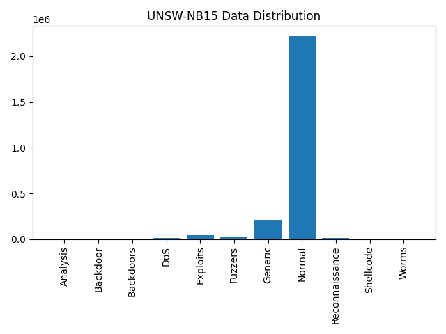

# UNSW-NB15 Dataset :

The data distribution :

    {
        "Normal": 2218764 (87.35%),
        "Exploits": 44525 (1.75%),
        "Reconnaissance": 13987 (0.55%),
        "DoS": 16353 (0.64%),
        "Generic": 215481 (8.48%),
        "Shellcode": 1511 (0.06%),
        "Fuzzers": 24246 (0.95%),
        "Worms": 174 (0.01%),
        "Backdoors": 534 (0.02%),
        "Analysis": 2677 (0.11%),
        "Backdoor": 1795 (0.07%),
    }

The initial features (and those that are used in the example, and the ones used in the article izualisation):

    {
        srcip, --- , ---
        sport, --- , ---
        dstip, --- , ---
        dsport, --- , ---
        proto, proto, proto
        state, state, state
        dur, dur, dur
        sbytes, sbytes, sbytes
        dbytes, dbytes, dbytes
        rate, rate, rate
        sttl, sttl, sttl
        dttl, dttl, dttl
        sloss, sloss, sloss
        dloss, dloss, dloss
        service, service, service
        sload, sload, sload
        dload, dload, dload
        spkts, spkts, spkts
        dpkts, dpkts, dpkts
        swin, swin, swin
        dwin, dwin, dwin
        stcpb, stcpb, stcpb
        dtcpb, dtcpb, dtcpb
        smeansz, --- , ---
        dmeansz, --- , ---
        trans_depth, trans_depth, ---
        res_bdy_len, --- , ---
        sjit, sjit, sjit
        djit, djit, djit
        stime, --- , ---
        ltime, --- , ---
        sintpkt, --- , sintpkt
        dintpkt, --- , dintpkt
        tcprtt, tcprtt, tcprtt
        synack, synack, ---
        ackdat, ackdat, ---
        is_sm_ips_ports, is_sm_ips_ports, ---
        ct_state_ttl, ct_state_ttl, ---
        ct_flw_http_mthd, ct_flw_http_mthd, ---
        is_ftp_login, is_ftp_login, ---
        ct_ftp_cmd, ct_ftp_cmd, ---
        ct_srv_src, ct_srv_src, ---
        ct_srv_dst, ct_srv_dst, ---
        ct_dst_ltm, ct_dst_ltm, ---
        ct_src_ ltm, --- , ---
        ct_src_dport_ltm, ct_src_dport_ltm, ---
        ct_dst_sport_ltm, ct_dst_sport_ltm, ---
        ct_dst_src_ltm, ct_dst_src_ltm, ---
        attack_cat, attack_cat, attack_cat
        label, label, label
    }

# UNSW-NB15 Example dataset :

The data distribution :

Training set :

    {
        "Normal": 37000 (44.94%),
        "Reconnaissance": 3496 (4.25%),
        "Backdoor": 583 (0.71%),
        "DoS": 4089 (4.97%),
        "Exploits": 11132 (13.52%),
        "Analysis": 677 (0.82%),
        "Fuzzers": 6062 (7.36%),
        "Worms": 44 (0.05%),
        "Shellcode": 378 (0.46%),
        "Generic": 18871 (22.92%),
    }

Testing set :

    {
        "Normal": 56000 (31.94%),
        "Backdoor": 1746 (1.0%),
        "Analysis": 2000 (1.14%),
        "Fuzzers": 18184 (10.37%),
        "Shellcode": 1133 (0.65%),
        "Reconnaissance": 10491 (5.98%),
        "Exploits": 33393 (19.04%),
        "DoS": 12264 (6.99%),
        "Worms": 130 (0.07%),
        "Generic": 40000 (22.81%),
    }

_Data_Distribution.png>)
