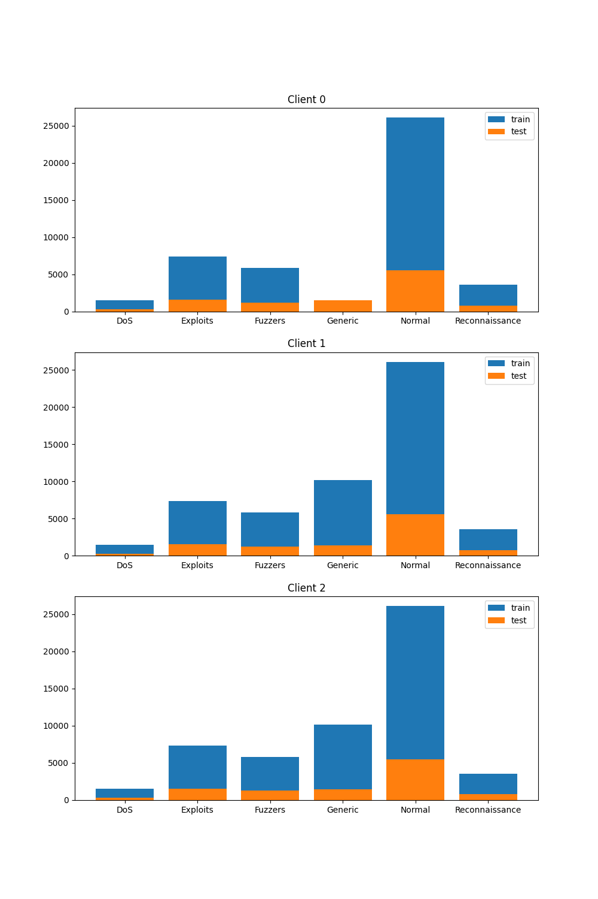

# Intrusion Detection System for IoT devices using Federated Learning

Clément S., Sarah R.

*Télécom SudParis, Palaiseau, France*

## Abstract 

> With IoT systems spreading across all the different domains and aspects of our lives for the past few years, attacks on these devices have likewise seen a rise. 

## I. Introduction 

As the Internet of Things (IoT) continues to proliferate across diverse domains, the security challenges associated with IoT devices become increasingly paramount. This paper, as part of a Master's year project, presents an approach to enhancing the security of Local Area Networks (LAN) with IoT environments through the implementation of an Intrusion Detection System (IDS) utilizing Federated Learning (FL). 

This paper aims to present Federated Learning, and goes into details on how. During this project, we aimed to 
The proposed system leverages the decentralized nature of FL to address privacy concerns inherent in traditional centralized IDS architectures. In this research project, we aimed to investigate further on Intrusion Detection Systems, and get a grasp of their functioning. With first a binary classification, then multi-class classification. 

Our framework enables IoT devices to collaboratively train a global intrusion detection model while keeping sensitive data localized on individual devices. This decentralized approach not only enhances data privacy but also contributes to the scalability and efficiency of the intrusion detection process. We evaluate the effectiveness of our system through extensive simulations and experiments, demonstrating its ability to detect a wide range of intrusions while preserving the confidentiality of sensitive information.

The results showcase the potential of Federated Learning as a robust and privacy-preserving solution for building resilient Intrusion Detection Systems in IoT environments. The proposed framework not only addresses the current security challenges in IoT but also provides a foundation for developing adaptive and intelligent security mechanisms for the evolving landscape of connected devices

*We would like to point out that as Network Security students, Machine Learning, thus Federated Learning, is not our area of expertise. The purpose of this research project was to understand how Federated Learning was used in Network Intrusion Detection Systems (NIDS) and to understand the main issues concerning this technique.*

**As this paper is still a draft, the following statement might evolve over the time:**
This paper is sectionned as follows: first, we expose Federated Larning and explain how it works.

ge0C0ASeIUKpf5Q

## II. Federated Learning: An overview 

How are the data aggregated? 
After the clients train their models, updated model parameters are sent to the server-based aggegator. To aggregate the new parameters to the global model, a general technique which is used is called _FederatedAverage_. This algorithm aggregates the parameters based on the weight of each client, which are calculated based on their dataset's size. 
By only exchanging weight parameters instead of raw data, this process is inherently privacy-preserving. However, this scheme is not fully safeguarded against all types of malicious attacks: different attacks, such as _Membership inference_ for example. \
Notwithstanding, 

Our Intrusion Detection System is a behavior-based IDS. In other words, the IDS 
## Dataset presentation

The dataset on which this project is based is the UNSW-NB15 dataset. Before this dataset, two others were largely looked upon: KDDCUP99 and NSLKDD. However, these two datasets were outdated, and not representative of the [[1]](#1)

2,540,044 flows of traffic were opened for this dataset. 
Eleven types of attacks were categorized, as follows: \
- Fuzzers
- Analysis 
- DoS 
- Exploits
- Generic
- Reconnaissance 
- Shellcode 
- Backdoors 
- Worms  

It is important to notice that in this dataset, the distribution is not equal for every attack [[2]](#2), and quite different in some ways. This can largely affect the classifications (see results).
The features were classified into three groups : Basic, Content, and Time. '0' refers to, in the dataset, as a regular behavior, while '1' refers to a malicious behaviour. 

### Visualization 

In order to understand the results better and to get a clear view on what information they do provide, different visualization approaches were in use. 
Some features were redundant in the testing set. 
175,341 records were selected for the training set, 82,332 records for the testing set. 
All of the features may not be relevant. The nominal features are converted to numeric features. 
After the distance between centroids has been calculated, the results are plotted. 
On the plot, a colored scaled represents as follows: the darker shades mean that the centroids were separated by a long distance, the lighter, by a shorter distance (classes are closer).

Principal Component Analysis (PCA) is 
Overlap problem: many attacks have a similar behavior comparing to 

### Evaluations 

Different methods exist to evaluate models: FedFomo [[4]](#4) and L2C are one of them.

For client selection in federated learning : 
Interesting topic to learn more about how Trusted Execution Environment (TEE) may make FL more robust against integrity attacks: 
Y. Chen et al., “A Training-Integrity Privacy-Preserving Federated
Learning Scheme with Trusted Execution Environment,”
Information Sciences, vol. 522, 2020, pp. 69–79.

The device's resource, time consumption, as well as communcation cost should be looked upon in order to determine the selection of clients. 

## Issues with Federated Learning and with Machine Learning in general

> What is the rate of false positives which make IDS unusable for real life conditions? 

Diversity in the network traffic.
Impact de l'apprentissage fédéré sur ça

## Implemented IDS

### First experiment: binary classification

### Second experiment: multi-class classification 

In this section, we explore our second experiment, this time with multi-class classification Federated Learning. 
To tackle the issue of 

After some experiment and some time, another idea struc

### Data repartition

The third 

In this experiment, the feature "rate" was not taken in the features we wanted to keep. 
It was still kept in 
Even though in most litterature, 24 features, amongst which the feature "rate" was taken into account, 

Last time, we saw the differecence b
to see for the federated evaluation. To see if it works. 
What we didn't take into account is that the FE is different for every client. THey are going to evaluate the same model. 

L'évaluation est faite après l'aggrégation. 
Si on a trois clients, si un n'a pas les connaissances de certaines classes d'attaques. 
VOir les résultats de modèle locale la classe manquante en voyant la plus-valu

Dans un monde de soucis de protection des données, on ne partage que des modèles. 

Présenter les résultats avec hopefully les résultats cohérents qui co
état de l'art/background/restituer les recherches
Attention
Dire les obstacles qu'on a rencontré
Fuzzing 
Fonction

## Bilan
Expériences, bilan, enseignements à tirer comment bien effecuter l'apprentissage

## References
<a id="1">[1]</a> 
Moustafa, Nour & Slay, Jill. ([2015](https://www.researchgate.net/publication/287330529_UNSW-NB15_a_comprehensive_data_set_for_network_intrusion_detection_systems_UNSW-NB15_network_data_set)). 
*UNSW-NB15: a comprehensive data set for network intrusion detection systems (UNSW-NB15 network data set).*
10.1109/MilCIS.2015.7348942. 

<a id="2">[2]</a>
Zoghi, Zeinab & Serpen, Gursel. ([2021](https://arxiv.org/abs/2101.05067)).
*UNSW-NB15 Computer Security Dataset: Analysis through 
Visualization.*
Electrical Engineering & Computer Science, University of Toledo, Ohio, USA.

<a id="3">[3]</a> Ajout

<a id="4">[4]</a> 
Zhang, Michael, et al. ([2020](https://arxiv.org/abs/2012.08565)).
"Personalized federated learning with first order model optimization." arXiv preprint arXiv:2012.08565 

<a id="5">[5]</a> 
Shuangton Li, et al. ([2022](https://openaccess.thecvf.com/content/CVPR2022/papers/Li_Learning_To_Collaborate_in_Decentralized_Learning_of_Personalized_Models_CVPR_2022_paper.pdf)). 
"Learning to collaborate in decentralized learning."