\newpage

# Abstract 

> With IoT systems spreading across all the different domains and aspects of our lives for the past few years, attacks on these devices have likewise seen a rise. Intrusion Detection Systems come in handy to identify and prevent any intrusion or attack directed towards these systems. However, in a world where the concern for data protection is crucial, it is important not to share data. Hence the raise of Federated Learning, especially in Intrusion Detection Systems. 

\newpage


# 1. Introduction   

As the Internet of Things (IoT) continues to proliferate across diverse domains, the security challenges associated with IoT devices become increasingly paramount. This paper, as part of a Master's year project, presents an approach to enhancing the security of Local Area Networks (LAN) with IoT environments through the implementation of an Intrusion Detection System (IDS) utilizing Federated Learning (FL). 

This paper aims to present Federated Learning, and goes into details on how it works (the theory behind it), and is constructed around the multiple experiments which where conveyed over the course of this project. During this project, we aimed to implement a basic IDS using different libraries which we will explore in the following parts.
The proposed system leverages the decentralized nature of FL to address privacy concerns inherent in traditional centralized IDS architectures. In this research project, we aimed to investigate further on Intrusion Detection Systems with FL, and get a grasp of their functioning. With first a binary classification, then multi-class classification. 

Our framework enables IoT devices to collaboratively train a global intrusion detection model while keeping sensitive data localized on individual devices. This decentralized approach not only enhances data privacy but also contributes to the scalability and efficiency of the intrusion detection process. We evaluate the effectiveness of our system through extensive simulations and experiments, demonstrating its ability to detect a wide range of intrusions while preserving the confidentiality of sensitive information.

The results showcase the potential of Federated Learning as a privacy-preserving solution for building strong Intrusion Detection Systems in IoT environments. The proposed framework not only addresses the current security challenges in IoT but also provides a foundation for developing adaptive and intelligent security mechanisms for the evolving landscape of connected devices. Notwithstanding, as robust as it may appear, our implementation was vulnerable and not fully resilient to specific FL-oriented attacks such as Data Poisoning. Some counter-measures were identified, such as the KrumFusion for instance, to tackle this issue. 

*We would like to point out that as Network Security students, Machine Learning, thus Federated Learning, is not our area of expertise. The purpose of this research project was to understand how Federated Learning was used in Network Intrusion Detection Systems (NIDS) and to understand how it could be implemented, and the main issues concerning this technique.*

**As this paper is still a draft, the following statement might evolve over the time:**
This paper is sectionned as follows: first, we expose Federated Larning and explain how it works.
Then, we will explore our two approaches for this experiment, both with with binary and multi-class classification. To conclude, we will 

\newpage

# 2. Federated Learning: An overview 

Federated Learning is a machine learning approach that enables model training (and testing) across decentralized devices holding local data samples without exchanging them. The main goal is to build a model by collaborativly learning from local data while keeping the data localized and private. There are many different kinds of implementations as well, and we will only talk about cross-device federated learning, since we want a scenario where some individual clients (which represent the IoT subnetworks) can contribute to the creation of a global model, which is more accurate than the individual ones.

The main steps of the federated learning are the following :  

- **Initialisation** : This step can be offline or online. In this part we create the unique shape of the model and some local training parameters like the number of epochs, the batch size or the validation split for each client  
- **Local Training** : The local devices use their local data to futher train the global model. Then they send to the aggregator the weights of their new model.  
- **Aggregation** : The servers then collect all the different results and combine them to get a global model. *(We will see after that what kind of fusion we can do to get a global model)*  
- **Iteration** : The weights of the global model are sent back to each client and we repeat the steps 2 and 3 until we finished.  

> In some cases, we can combine Federated Learning and Transfert Learning to have better results. To do so, after reiceiving the last global model from the server, one device can decide to perform an other local training to enhace the performance of its model in its particular situation.

So now, what are the different way to merge the client's model in the aggregation step ?

>**(How are the data aggregated? )**

So after the clients train their models, updated model parameters are sent to the server-based aggegator. To aggregate the new parameters to the global model, the most simple method used is called _FederatedAverage_. This algorithm aggregates the parameters by doing a weighted mean between all the client's model. The weight of each client can be calculated based on their dataset's size, number of epochs passed during the training or other parameters. 

By only exchanging weight parameters instead of raw data, this process is inherently privacy-preserving. However, this scheme is not fully safeguarded against all types of malicious attacks: different attacks, such as _Membership inference_ for example.

In this study we will almost only use the _FederatedAverage_ method, but in the last part, we will process some simulation using another method called _KrumFusion_. In this method, client are evaluated just before they contribute to the global model. If one client seems malicious, its contribution to the global model will be different from the other normal clients. So by evaluating the client's contribution, we can exclude the client responsible of an anormal contribution to the global model. 

>**Need more sources**

Our Intrusion Detection System is a behavior-based IDS, opposed to a Rule Based Intrusion detection system[[7]](#7). In other words, the IDS classifies the incidents based on an event rather than based on rules. This means the different incidents are classified as belonging to certain classes (in a binary classification, either legitimate (or normal) traffic, and illegitimate (or malicious) traffic). This approach is extremely effective as it is a good compromise between both generality and precision, however, it does not give specific insights on the attack in particular, and in the case of our first binary classification experiment, did not specify to which attack category it belonged to. In addition, this is an *anomaly based detection*, which is when the normal (or legitimate) traffic is learned by the algorithm. 

\newpage

# 3. Dataset presentation

The dataset on which this project is based is the UNSW-NB15 dataset. Before this dataset, two others were largely looked upon: KDDCUP99 and NSLKDD. However, these two datasets were outdated, and not representative of the actual traffic representation. [[1]](#1) The UNSW-NB15 dataset is a hybrid model: it is constructed based on real modern and normal behavior, with synthetical attack activities. 

The dataset creation involves using the IXIA traffic generator configured with three servers, where one server simulates illegitimate traffic. The generated data is in pcap format, transformed into CSV files using tools like Argus and Bro-IDS. Features extracted include packet-based and flow-based characteristics, categorized into "Basic," "Content," and "Time."

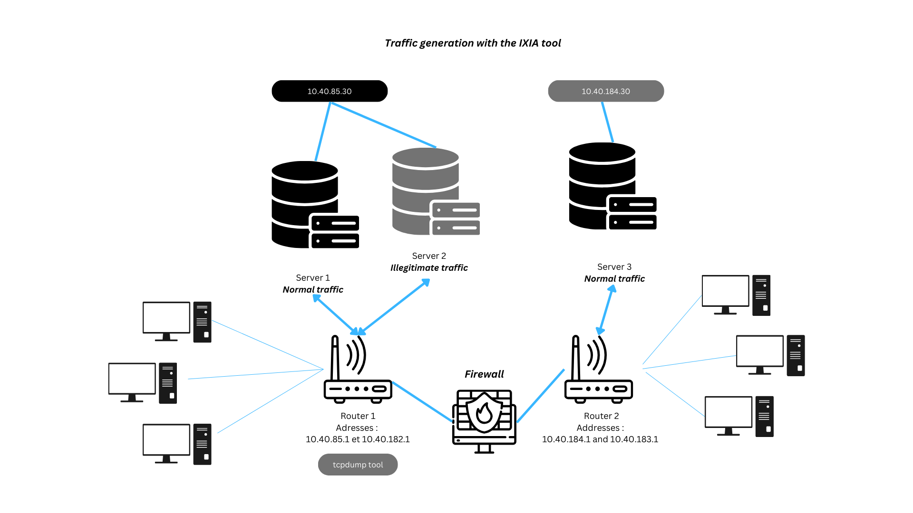

Eleven types of attacks were categorized, as follows: \
- Fuzzers
- Analysis 
- DoS 
- Exploits
- Generic
- Reconnaissance 
- Shellcode 
- Backdoors 
- Worms  

2,540,044 flows of traffic were opened for this dataset. 
It is important to notice that in this dataset, the distribution is not equal for every attack [[2]](#2), and quite different in some ways. This can largely affect the classifications (see results).

The extracted features include a variety of other features based on packets and flows:

- Packet-based features: They assist in examining the payload in addition to packet headers.
- Flow-based features: They focus on connected packets in network traffic, allowing for a lighter analysis.

It is important low-based features depend on direction, inter-arrival time, and inter-packet length.

In this dataset, there were two main problems: 
- class imbalance 
- class overlap.

These problems will have an impact on the classification as we will see in the results part of our implementation. 

In multiple experiments which will be presented further in this document, some classes will overlap over each other, which will cause many misclassification problems. 

## 3.1 Preprocessing 

The initial stage involves preprocessing the data to tailor the raw dataset to our requirements. Initially, we merge the four files from the original UNSW-NB15 dataset. Subsequently, we eliminate duplicate entries and identify the desired features based on the criteria outlined in this article [[2]](#2). This ensures consistency in results and provides a solid foundation for our analysis. The selected features are :


| Feature No. | Input Feature Name | Description                                     |
|:-----------:|:-------------------:|:-----------------------------------------------:|
|      1      |         dur         |        Record total duration                    |
|      2      |        proto        |        Transaction protocol                     |
|      3      |       service       |   Contains the network services                  |
|      4      |        state        | Contains the state and its dependent protocol   |
|      5      |        spkts        | Source to destination packet count               |
|      6      |        dpkts        | Destination to source packet count               |
|      7      |       sbytes        | Source to destination transaction bytes         |
|      8      |       dbytes        | Destination to source transaction bytes         |
|      9      |        rate         | Ethernet data rates transmitted and received    |
|     10      |        sttl         | Source to destination time to live value         |
|     11      |        dttl         | Destination to source time to live value         |
|     12      |       sload         | Source bits per second                           |
|     13      |       dload         | Destination bits per second                      |
|     14      |       sloss         | Source packets retransmitted or dropped         |
|     15      |       dloss         | Destination packets retransmitted or dropped    |
|     16      |       sinpkt        | Source interpacket arrival time (mSec)          |
|     17      |       dinpkt        | Destination interpacket arrival time (mSec)     |
|     18      |        sjit         | Source jitter (mSec)                             |
|     19      |        djit         | Destination jitter (mSec)                        |
|     20      |        swin         | Source TCP window advertisement value            |
|     21      |       stcpb         | Destination TCP window advertisement value       |
|     22      |       dtcpb         | Destination TCP base sequence number             |
|     23      |        dwin         | Destination TCP window advertisement value       |
|     24      |       tcprtt        | TCP connection setup round-trip time             |
|     25      |     attack_cat      | The name of each attack category. In this data set, nine categories e.g. Fuzzers, Analysis, Backdoors, DoS Exploits, Generic, Reconnaissance, Shellcode, and Worms |
|     26      |       label         | 0 for normal and 1 for attack records           |

Some features were redundant in the testing set, such as ... and ... which are actually other. 

After this step, we reduce the normal traffic by randomly taking a part of the traffic with a label equal to 0. This can allow us to reduce the normal traffic and to simplify the classification. Finally, we also simplify the problem by dropping the unpopulated attack categories.

After having randomly split the entier dataset in a training set (80%) and a testing set (20%), the data distribution is : 

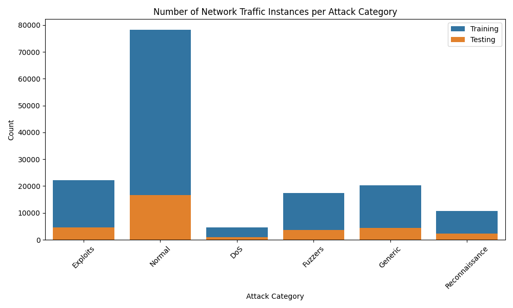

Here we have taken 5% of the normal trafic entries.

We can also mention that some other preprocessing will be done juste before the simulation process, during the creation of the client's datasets. In those steps, we take the data, create the X and Y vectors based on the *attack_cat* and *label* features. Then we apply a one hot encoding and a quantile transformation. The one hot encoding allow us to convert proprely the nominal features without introduce non wanted relation between the nominal classes. The quantile transformation is choose accordingly th the vizualisation article. This method ensures increased separation between centroids of each class, making them more distinguishable and facilitating easier detection of individual classes.

>**Copier la figure des centroids ?**

## 3.2 Visualization 

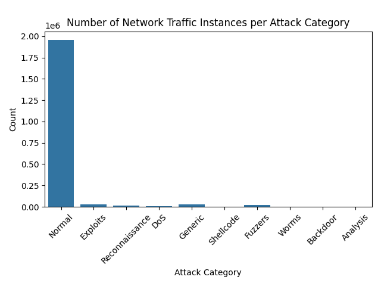


In order to understand the results better and to get a clear view on what information they do provide, different visualization approaches were in use. 

175,341 records were selected for the training set, 82,332 records for the testing set. 
All of the features may not be relevant. The nominal features are converted to numeric features. 
After the distance between centroids has been calculated, the results are plotted. 
On the plot, a colored scaled represents as follows: the darker shades mean that the centroids were separated by a long distance, the lighter, by a shorter distance (classes are closer).

insert the images of the visualisation artiicle (or just cite the article)
->
Principal Component Analysis (PCA) is 
Overlap problem: many attacks have a similar behavior comparing to 

## 3.3 Evaluations 

In order to evaluate the different models, a large panel of metrics came in handy. Following the federated training phases, which included local trainings and aggregations, we evaluated the model using a portion of the UNSW-NB15 dataset that was initially set aside for testing purposes. To establish a foundational understanding, let's outline the different metrics that we employed:

- Precision: this metric is used to evaluate the performance of the FL model. It assesses the accuracy of positive predictions made by a classification model. This metric is determined by dividing the number of correct positive predictions (true positives) by the total sum of correct positive predictions and incorrect positive predictions (false positives). In essence, precision evaluates the model's capability to make positive predictions with a high level of correctness.  

$$
Precision = \frac{True\ Positives}{True\ Positives + False\ Positives}
$$

- Recall: also referred to as the true positive rate, quantifies the ability of a classification model to correctly identify instances belonging to the positive class. This metric is computed by dividing the number of true positive predictions by the total sum of true positive predictions and false negative predictions. In essence, recall assesses the model's effectiveness in capturing and correctly labeling all actual positive cases among the predicted outcomes.  

$$
Recall = \frac{True\ Positives}{True\ Positives + False\ Negatives}
$$

- F1 Score: the F1 Score will then compute the harmonic mean between the precision and recall.

$$
F1\ Score = \frac{2 \times Precision \times Recall}{Precision + Recall}
$$

- Accuracy: 
$$
Accuracy = \frac{True\ Positives + True\ Negatives}{Total\ Examples}
$$

In centralized evaluation, the aggregator server conducts the evaluation after the training process. This implies that the aggregator server must possess a testing set. In a typical setup, the aggregator would ideally have its own data to maintain the privacy aspect of federated learning. However, this raises the challenge of sourcing data for the aggregator. To address this, we can employ federated evaluation. In this approach, each client independently evaluates the model using its own testing set. Subsequently, the clients return their metrics to the aggregator, which then aggregates these metrics. For aggregation, we can use algorithms such as the AverageFusion algorithm, or alternatively, we could aggregate metrics using a random choice among some clients or other methods.

Specifically, in the Flower library, both centralized and federated evaluations can be performed, and the evaluation process occurs at every round (each local training + aggregation phases). Additionally, in distributing the data to the clients, we split the testing set among each client. If we opt for federated evaluation, each client will have its own testing set. If we choose centralized evaluation, we simply aggregate all the testing data from each client for the aggregator.

In our research, we exclusively used centralized learning since our testing set was evenly split between the three clients. However, further exploration could involve using a partial testing set for some clients and attempting to achieve correct learning in such scenarios.

In the upcoming sections, to gain a more detailed understanding of the results in multiclass classification, we will include the visualization of confusion matrices. These matrices directly illustrate the correspondence between the input attack categories and the predicted output provided by the model. This visualization will enhance our comprehension of the model's performance.

>**remove old part ?**

old part :
Different methods exist to evaluate models: FedFomo [[4]](#4) and L2C (Learning to Collaborate) are one of them. These two techniques are personalized FL algorithms which locally evaluate the models from other clients to locally customize them.  
**Important remark: these evaluation methods were only studied and researched at the beginning. They were not used during the course of our project. Notwithstanding, we found them interesting, and they could be the subject of further research by the reader.**

For client selection in federated learning : 
Interesting topic to learn more about how Trusted Execution Environment (TEE) may make FL more robust against integrity attacks: 
Y. Chen et al., “A Training-Integrity Privacy-Preserving Federated
Learning Scheme with Trusted Execution Environment,”
Information Sciences, vol. 522, 2020, pp. 69–79.

The device's resource, time consumption, as well as communcation cost should be looked upon in order to determine the selection of clients. 

\newpage

# 4. Implemented IDS

[IBM-FL](https://github.com/IBM/federated-learning-lib/tree/main) was the first notebook used to understand more ML and FL concepts.
Flwer is the second module which was used in this experiment. 

The computer which was used to train all the data is 

Number of epochs + rounds for each training.

## 4.1. The Simulation Environment

In this part we are just going to describe the simulation process that we used in our set up. In order to get the previous results we went into many simulations, adjusting a lot of parameters. And to do so, we have decided to create a simulation template, that can allow everyone to reroduce our experimentations. Instead of creating a Jupyter Note Book, we've created à [GitHub project](https://github.com/ClementSafon/IDS_FL_Simulation) that have all the necessary ressources to execute simulation without having to write anything. To reproduce, modify or go deeper into our researches, you can find all you need in this repository. There is documentation about, how to install, configure and run a simulation. Feel free to fork this project in case you want to upgrade it.


## 4.2. First experiment: binary classification

In the first experiment, we went for the most simple IDS behavior, the one that can classify a network traffic either in Normal or Malicious. That allowed us to understand the federated mechnaismes and to manipulate some basic and still efficient models. In this party, we worked a lot base on the work of the works of [Yann Busnel and Léo Lavaur](https://github.com/phdcybersec/nof_2023/tree/main). The main objective here was to understand how the classification models works, how we can set up a federated learning environment to test the performances of our machine learning process and finally, show the benefit of the federated learning compared to traditionnal machine learning.

In this simulation we used the same model that the one used by Yann Busnel and Léo Lavaur. It is a neural network constructed using TensorFlow's Keras API. The model consists of three layers: the first layer is a densely connected layer with 64 units and a rectified linear unit (ReLU) activation function, taking an input shape defined by the variable n_features. This is followed by a dropout layer with a dropout rate of 0.5, intended to enhance generalization by randomly deactivating half of the units during training. The second layer mirrors the structure of the first with another dropout layer. The final layer is a densely connected layer with 2 units, employing the softmax activation function to produce probability distributions for classification tasks. This neural network configuration aims to capture complex patterns within the input data, with the dropout layers contributing to regularization to prevent overfitting during the training process.

In our case we have 191 features and the model is : 

***Model: "sequential"***

| Layer (type)         |       Output Shape        |      Param #|
|:--------------------:|:-------------------------:|:------------:|
| dense (Dense)         |      (None, 64)            |    12288    |
| dropout (Dropout)     |      (None, 64)            |    0|   
 |dense_1 (Dense)       |      (None, 64)            |    4160|   
 |dropout_1 (Dropout)   |      (None, 64)             |   0|
| dense_2 (Dense)       |      (None, 2)              |   130|
                                                                 

Total params: 16578 (64.76 KB)
Trainable params: 16578 (64.76 KB)
Non-trainable params: 0 (0.00 Byte)

As for the optimizer, we opted for a conventional choice – the Adam Optimizer with a learning rate set at 0.001. Despite its simplicity, this model has demonstrated effectiveness, particularly when handling one-hot encoded input data.

Furthermore, we have the flexibility to adjust other parameters of the clients, including the number of epochs performed, the batch size, and the validation split. Throughout the subsequent simulations in this project, the validation split will be arbitrarily set at 0.2. Regarding the other parameters, their relevance is limited in this relatively simple problem. Hence, only 2 epochs and 3 rounds can yield satisfactory results, as we will observe. (It will become less trivial with the multiclassification process.)

So after testing various configurations for each client epochs, batch-size and number of rounds, we obtained promising results in terms of F1-score and accuracy, as illustrated in the following example:

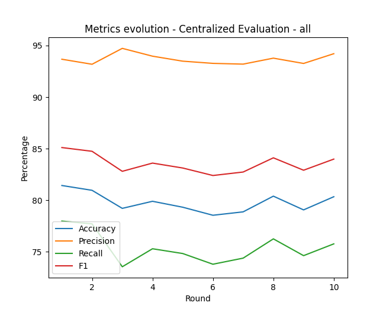


Following this initial step, we proceeded to explore different aspects of federated learning. One aspect that particularly interested us was the ability for each client to contribute to enhancing the model using their own data, which may not be shared with other clients. For instance, a specific malicious behavior identified in one precise subnetwork can prove beneficial for other clients as well. As a next step, we aimed to evaluate our training process's ability to deliver complementary information between clients.

To prove this, we had to split the dataset into the N clients, but this time, not randomly since some client must not have a particular type of data. The two methods taken into account were, splitting data by IP sources or destinations to affect one client to one real subnetwork for example, or splitting data according to one attack category to allow us to give only specific attack categories for one client, and see if this client is able to perform well on the detection of unknown attack categories thanks to the federated learning. Finally we went for the second method, since we were able to split data more precisly and independantly from the network configuration of the dataset creation team.

So now, we are able to split all the data between N client and destroy all the data categorised as *Backdoors* for just one client. Then we wanted to see if that same client can, after the learning process, detect well the backdoors thanks to the federated learning. However, this is where the biggest problem of our simulation lied. Indeed, we were classifying the network traffic as either Normal or Malicious. So when testing the special client performance, we were not able to detecte if this client was able to detecte especially *Backdoors* or not and the impact since *Backdoors* results are just drown into all the Maliscious results. That is why, more precision was requested to be able to detecte precis results, and we went for a multiclassification in the second part.


## 4.3. Second experiment: multi-class classification

In this section, we explore our second experiment, this time with multi-class classification Federated Learning.

In line with our earlier expectations, in this phase, we can readily distinguish traffic based on attack categories and attempt to demonstrate and quantify the effectiveness of applying federated learning to IDS.

Before delving into the three simulations we conducted, let's discuss the model. Due to our limited knowledge in machine learning, we opted for a similar model to the previous one. However, we introduced additional complexity to enhance performance in a more intricate multiclassification setup. This involved incorporating more hidden layers with increased parameters, essentially adding more depth to the model.

The model we used is the following one (with 178 features now) : 

***Model: "sequential"***

| Layer (type)    | Output Shape | Param # |
|:---------------:|:------------:|:-------:|
| dense (Dense)   | (None, 128)  | 22912   |
| dropout (Dropout)| (None, 128)  | 0       |
| dense_1 (Dense) | (None, 256)  | 33024   |
| dropout_1 (Dropout)| (None, 256)| 0       |
| dense_2 (Dense) | (None, 128)  | 32896   |
| dropout_2 (Dropout)| (None, 128)| 0       |
| dense_3 (Dense) | (None, 64)   | 8256    |
| dropout_3 (Dropout)| (None, 64) | 0       |
| dense_4 (Dense) | (None, 6)    | 390     |
                                                            

Total params: 97478 (380.77 KB)
Trainable params: 97478 (380.77 KB)
Non-trainable params: 0 (0.00 Byte)

Here, we employed the same optimizer as before, the Adam optimizer, with a lower learning rate set at 0.0001 to enhance our likelihood of success.

Regarding the number of epochs, batch size, and the number of rounds, we now encounter a more challenging situation. Given the increased complexity of the multiclassification process compared to the previous one, achieving satisfactory results will require at least 10 rounds and 20 epochs, with a batch size of 64. Additionally, it's worth noting that our dataset is initially structured for training a single model. With three clients involved, the data is naturally divided into three smaller datasets. Having less data could make obtaining good results more challenging.

Now we can test our model to see if it is a correct IDS that perform well enought to allow us to continue our simulations.

>**inserer image resultat 20rounds envoyé par messenger + confusion matrix à envoyer. Tout ça d'un FL 3 client, all data**

We have now correct results and can pass to the next step.

In the upcoming sections, we will conduct three simulations to assess the advantages of federated learning in different scenarios. The first simulation involves a single client working alone, having the entire dataset exclusively. This represents a standard centralized learning process. The second experiment replicates the previous centralized learning process, but this time, the client lacks a particular class in its training set, akin to a subnetwork lacking knowledge in a certain type of malicious traffic. In the final part, we will explore the results of federated learning involving three clients, where one of them is unaware of a specific attack category. In this last scenario, we aim to determine if the final global model can identify the missing class for the special client, making it possible for them to detect these particular types of attacks.

## 4.4. Data repartition

Will be presented in this section the different data repartitions of the three experiments we conveyed.
The first one, there is only one client which is trained on the whole dataset.

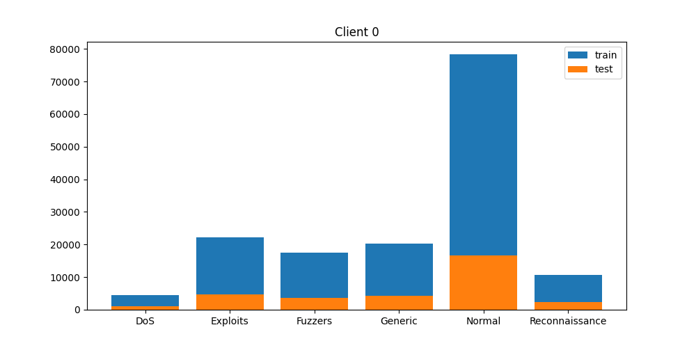

The second one, still with only one client  the first which has no network traffic from the "Generic class" in the training set.
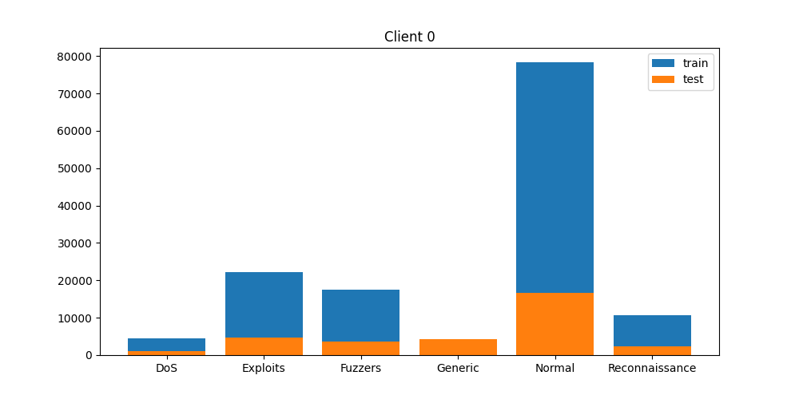

The third one, which was the last experiment we conducted, where each client had an even repartition of the dataset (1/3 of each class in which the network traffic was selected randomly), with the first client (client 0) who does have any traffic from the "Generic" attack class.  

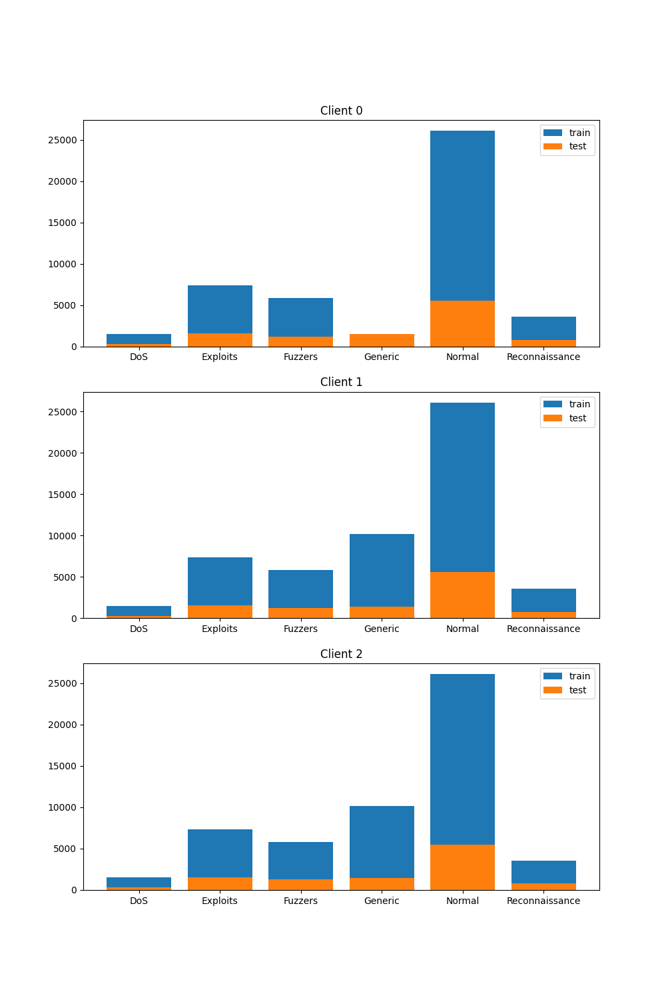

The third experiment was done in order to test if client 0 would benefit from the other clients by 
**Pourquoi ne pas avoir fait CL, FL avec tout, FL avec un client sans une classe?**

In this experiment, the feature "rate" was not taken in the features we wanted to keep. 
Even though in most litterature, only 24 features out of the 41 were kept, amongst which the feature "rate" was taken into account, in the training and testing set provided by the creators of the UNSW-NB15 dataset. 

What we didn't take into account is that the FE is different for every client. They are going to evaluate the same model. 

## 4.5 Results

The evaluation is then done after the aggregation part. 

After all the experiments, we can now conclude that the clients get better and they learn from the others. 

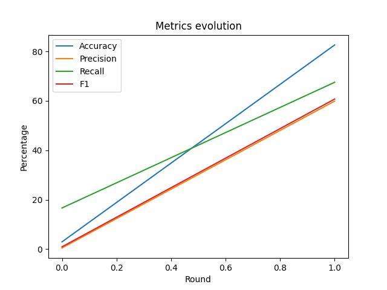

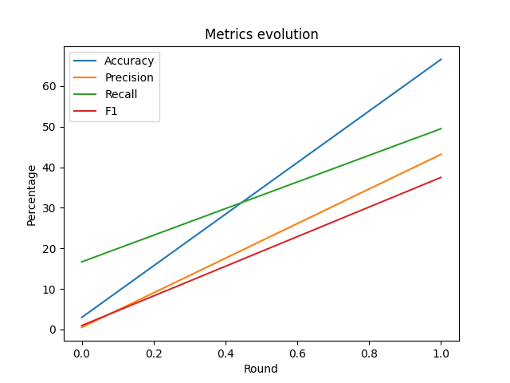

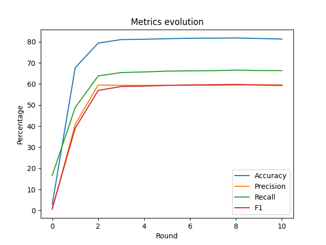

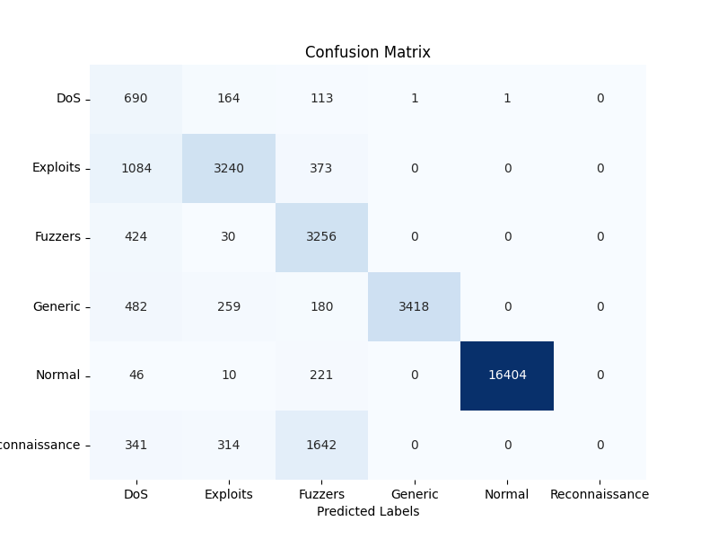  

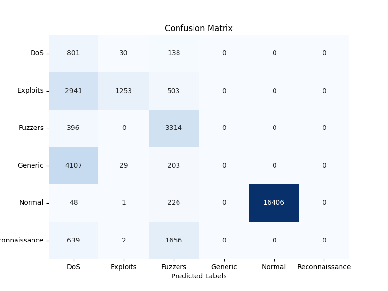  

  

Here is how confusion matrixes are read: on ordinate, the actual classes, on the abscissa, the predicted classes.

In the confusion matrixes, we can observe a few things: first, for the Centralized Learning with only the client 0 which has no knowledge of the attack "Generic", makes many mistakes on both "Generic", "Exploits", and "Reconnaissance" classes.  

In addition, it is important to note that the Federated Learning implementation has comparable results to the Centralized Learning one: 
- for the accuracy, after 1 round we obtain an accuracy around 85% for the CL, and around 80% for the FL (after 3 rounds), comparing to a 70% one for the second experiment,
- a similar number of Exploits, Fuzzers, Generic, and Normal were correctly classified for both CL and FL (True Positives),


There are, notwithstanding, two classes that seem to be misclassified, no matter whether CL or the FL: the DoS and Reconnaissance attack categories. Many "Reconnaissances" packets were misclassified as "Fuzzers", and "DoS" as "Exploits". This is mainly explained due to the fact that these attack category classes represent minorities. Furthermore, this is also explained by the class overlap. (Centroids figure with the t-SNE visualization)
Moreover, the traffic for the third experiment was split evenly and randomly for each and every attack category, which means that not all behaviors from the same attack category are represented. 
Overall, our results for the Federated Learning with three clients have promising results after only  a few rounds, proving that client 0 learns and benefits from the other clients after a few rounds. More rounds would mean more learning, which could then lead to an overfit of the model (which would be considered a downgrade). These results truly show a potential for FL in IDS.


\newpage

# 5. Attacks
## 5.1 Attack models

After the end of the implementation, the following part consisted in testing if the models were resilient to different attacks, and test different data poisoning scenarios.
We create three scenarios, each featuring two legitimate clients and one malicious client acting as the attacker.
In the first two attack scenarios, the attacker had limited knowledge of the actual implementation. However, in the third scenario, the attack performed was significantly more efficient but necessitated more information about the learning infrastructure.

### 5.1.1 Fuzzing attack

In this attack scenario, the objective was to evaluate the system's resilience and security by simulating a potential threat. Fuzzing, in this context, serves as a method to identify and address issues related to data handling, model updates, and communication protocols within the federated learning framework, aiming to enhance the overall system. The primary focus was on testing the simplest form of attack in our simulations.

The aim of this attack is for the attacker to send a randomly generated model to the aggregator after the training phase. The malicious client sends weights that are set randomly to disrupt the global model and potentially disable the IDS, which may no longer function correctly. It is important to note that this attack is quite brute-force and can be easily detected and countered.

In practice, during the learning phase when clients are adjusting their local models, the attacker (*client_0*) is already sending a false model with random weights selected between -5 and 5. These numbers are not chosen entirely randomly; they need to be significantly larger than an average real weight to introduce some disturbance into the final model. In our case, the weights rarely exceeded -3 or 3. It's essential to acknowledge that this range might vary based on the model and other parameters. However, it's feasible to retrieve the minimum and maximum from the global model provided to the clients before local training to set the appropriate range.  

With this kind of attack, we can have the following results:

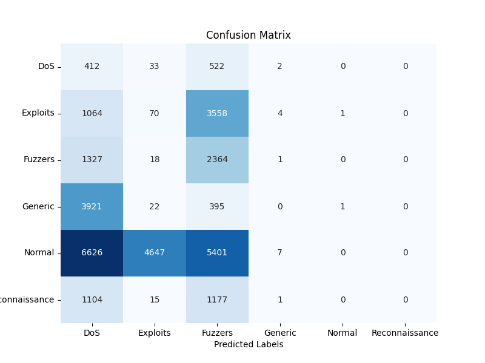

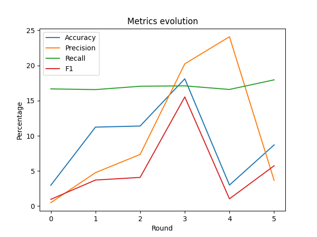

We can see that the metrics evolution is not stable; the model is not making any progress and just seems to return random results when testing it.
  
### 5.1.2 Simple poisoning attack

In this second scenario, our aim was to conduct a more sophisticated and targeted attack, one that is potentially less disruptive and more precise compared to the previous approach. Here, the attacker intends to send a deceptive model, which we hope will manipulate the global model to introduce malicious alterations. To achieve this, during the local training phase, the attacker trains the model to create a biased one. For instance, our malicious model could be trained to classify all traffic as "Normal," thereby reducing the efficiency of the IDS. Alternatively, the goal might be to make the model overlook a DOS attack, possibly to conceal a planned DOS attack. In our example, we opted for the former, where the malicious model detects and classifies all traffic as Normal.

In practice, we provided the attacker with a training set in which all traffic was labeled as Normal (we modified the Y_Train matrix by setting all lines to Normal). The attacker then sends its manipulated model.

So now, we have the following results:


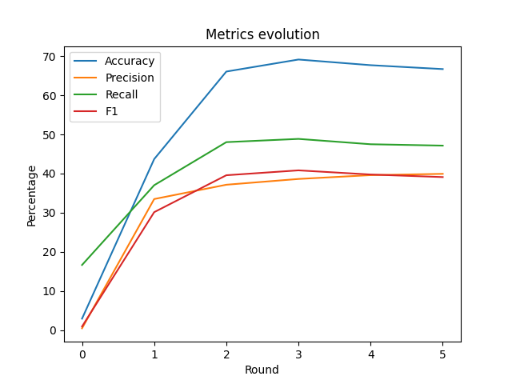

The performance of the IDS remains acceptable despite the presence of the malicious client. Although the model is not as accurate as the one without the malicious client, it continues to function. Additionally, there is an expectation that the model could potentially improve with more rounds and epochs during the federated training. In the current conditions, this attack doesn't prove to be highly efficient. However, we will explore potential enhancements in the next section.


### 5.1.3 Targeted poisoning attack

This third attack represents the most advanced stage in our project. Unlike the previous attacks, this poisoning attempt is more intricate and requires a deeper understanding of the federated learning infrastructure. The objective of this attack is to generate a malicious model after the aggregation phase. As observed earlier, sending a malicious model during the aggregation phase might not significantly impact the global model. Hence, it is crucial to manipulate the data precisely to obtain the desired malicious model resulting from the aggregation process.

This attack draws substantial inspiration from the article *"Machine Learning with Adversaries: Byzantine Tolerant Gradient Descent"*[[9]](#9). The article discusses the concept that if we possess knowledge about the number of clients in the federated learning process, along with their individual model weights and federated weights used during the aggregation phase, we can strategically send a model (**V**) to the aggregator to achieve the intended model (**U**) after the aggregation process.

Mathematically speaking this would result in this lemme extracted from [this article](#9) : 

***Lemme 1***

```{=latex}
\begin{tabular}{ll}

Consider an aggregation rule: \\
\( F_{\text{lin}} \) of the form \( F_{\text{lin}}(V_1, \ldots, V_n) = \sum_{i=1}^{n} \lambda_i \cdot V_i \),
where the \( \lambda_i \)'s are non-zero scalars. \\
Let \( U \) be any vector in \( \mathbb{R}^d \). \\ A single Byzantine worker can make \( F \) always select \( U \). \\
In particular, a single Byzantine worker can prevent convergence.
\\
Proof
\\
Immediate: if the Byzantine worker proposes \\
\( V_n = \frac{1}{\lambda_n} \cdot U - \sum_{i=1}^{n-1} \frac{\lambda_i}{\lambda_n} \cdot V_i \), then \( F = U \).
\end{tabular}
```

In practice, we introduced some modifications due to the unavailability of other clients' weights, typically provided to the aggregator. To estimate these weights, we conducted a normal fitting round, mimicking the process of the two other clients. These estimated weights were then treated as representative of the other clients' models. Additionally, knowing that the weights of each client used for the aggregation mean are uniform across all clients simplified the process.

To summarize the different steps of the attack during the attacker's local training phase:  
1. The attacker initially trains one model to estimate the weights of the other clients.  
2. Subsequently, the attacker trains another model with a modified y_train, similar to the previous attack where all real traffic is labeled as Normal.
3. The attacker calculates the final model using the proof formula. 
*Final_model = f(n_client, normal_model, malicious_model)*

Finally, the the results were the following : 

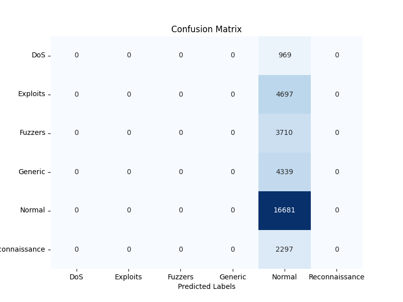

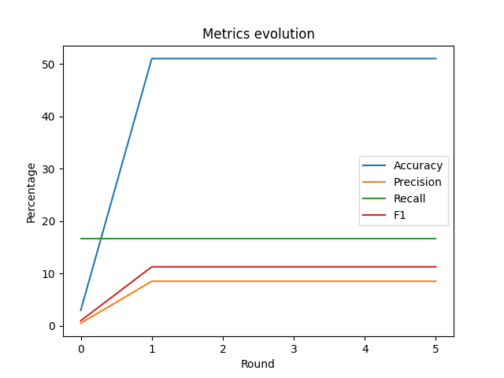

This is, by far, the most effective attack scenario. According to the Confusion Matrix (Figure[?]) All the malicious traffic was classified and predicted as normal traffic. That make us beleive that the estimated client's weights can be a good method in this case, however, it can be hard to estimate client's weights when they have a trainig set that largely differ with the attack one.

\newpage

# 6. Counter-measures 

After disrupting the learning process, it is imperative to discuss potential countermeasures. Our analysis has demonstrated that certain attacks can significantly impact the detection service and potentially compromise the overall security of the network. However, in our specific instances, we employed a simplistic and less robust method of aggregation, prompting us to explore alternative approaches.

Our investigation led us to various methods, among which the KrumFusion algorithm stood out. This method offers a level of robustness against malicious clients during the learning process. In contrast to the previously used AverageFusion, KrumFusion goes beyond simply averaging the model's weights. Instead, the algorithm calculates a form of learning gradient for each client's model. These gradients depict the optimization direction the client's model contributes to the overall model. This enables us to gain a comprehensive view of all client contributions, identifying both convergent and divergent ones. If a calculated gradient significantly differs from that of other clients, indicating a distinct optimization direction, we can identify potential malicious behavior in the learning process.

However, in real-world implementation, the challenge lies in accurately classifying a client's gradient as erroneous, rather than merely excluding a client with unique but valuable training data for federated learning. We subjected KrumFusion to testing against our most efficient attack, the targeted poisoning attack. To determine the client to eliminate, a parameter specifying the number of malicious clients was introduced, acknowledging the need for blue team involvement. Despite the need for further research to refine the exclusion process, our initial results were promising.

As illustrated in Figure:  
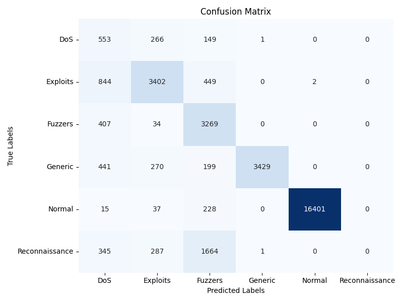,   the excluded client appeared to be genuinely malicious, as the learning process returned to normal.


\newpage 

# 7. Issues with Federated Learning and with Machine Learning


In this section, many issues and challenges which occur in Machine Learning as well as in Federated learning will be covered.

In any type of Machine Learning in general, the cleanliness of the data as well as the accurate labellisation is crucial. In our case, this had tremendous impact on the quality of the Intrusion Detection System, and can interfere with any potential commercial or legitimate usage.

IDSs, which many now rely on machine learning, play a critical role in cybersecurity, but misclassifications can have severe consequences. [3](#). These systems are central pillars to identify and respond to potential security threats, making them integral components of modern defense strategies. However, the impact of misclassifications, where benign activities are incorrectly flagged as malicious (false negative) or vice versa (false positive), can compromise the overall security posture. It reveals thus the importance of continual refinement and fine-tuning of ML/FL models within IDS to minimize false positives and negatives, and to ensure accurate threat detection without unnecessary disruptions to normal operations.

> What is the rate of false positives which make IDS unusable for real life conditions? 

The diversity in the network traffic also appears to be an issue. Let's imagine that we train a FL model with a certain type of network traffic. 
Diversity in the network traffic.

In ML, it is needed to have a suffiscient amount of data for each and every class in order to learn properly from the training dataset, and in order to detect them as well. How much?

The dataset had massive class overlap. [2](#)

\newpage


# 8. Conclusion and lessons learned 

In this research project, we explored the application of FL in the context of Intrusion Detection Systems (IDS) with Internet of Things (IoT) environments. The proliferation of IoT devices has increased the complexity of security challenges, making robust IDS crucial for safeguarding networks. Traditional centralized ML architectures pose privacy concerns, leading us to investigate the use of FL as a privacy-preserving solution.

The paper provided an overview of Federated Learning, explaining its principles and detailing the steps involved in the training process across decentralized devices. We implemented a FL-based IDS framework that allows IoT devices to collaboratively train a global intrusion detection model while keeping sensitive data localized. This decentralized approach enhances data privacy, scalability, and efficiency in the intrusion detection process.

Throughout our experiments, including both binary and multi-class classifications, using the UNSW-NB15 dataset, the results demonstrated the potential of FL as a privacy-preserving solution for building effective IDS in IoT environments. However, we acknowledged the vulnerability of our implementation to specific FL-oriented attacks such as Data Poisoning and identified counter-measures. We would still like to point out that our implementation is rather simple: it was a three client architecture.

The research highlighted the challenges and issues in the application of FL to IDS, such as the need for clean and accurately labeled data, diversity in network traffic, and the impact of false positives and negatives on the overall security posture. Additionally, we discussed the importance of continuous refinement and fine-tuning of ML/FL models within IDS to enhance accuracy.

The paper concluded by addressing potential counter-measures to the identified issues and emphasized the ongoing need for research and development in the intersection of Federated Learning and Network Security. Overall, this student research project contributes to understanding how FL can be utilized in the field of network security, paving the way for adaptive and intelligent security mechanisms in the evolving landscape of connected devices.

Our experiments, ranging from binary to multi-class classifications using the UNSW-NB15 dataset, underscored the effectiveness of FL as a privacy-preserving solution. The decentralized learning process proved capable of detecting a wide range of intrusions while maintaining confidentiality. The experiments also exposed certain vulnerabilities, such as susceptibility to FL-oriented attacks like Data Poisoning. Identifying counter-measures, such as the KrumFusion method, is a step towards fortifying our FL-based IDS against potential threats.

In acknowledging the challenges encountered, including data cleanliness, accurate labeling, and the impact of false positives and negatives, we underscore the importance of continual refinement and fine-tuning of our models. The diversity in network traffic emerged as a significant consideration, prompting us to recognize the need for a sufficient amount of diverse data for effective training and detection.


[commment] (#
- Expériences, bilan, enseignements à tirer comment bien effecuter l'apprentissage
- Présenter les résultats avec hopefully les résultats cohérents qui co
- état de l'art/background/restituer les recherches
- Dire les obstacles qu'on a rencontré
- Fuzzing)

\newpage


# References
<a id="1">[1]</a> 
Moustafa, Nour & Slay, Jill. ([2015](https://www.researchgate.net/publication/287330529_UNSW-NB15_a_comprehensive_data_set_for_network_intrusion_detection_systems_UNSW-NB15_network_data_set)). 
*UNSW-NB15: a comprehensive data set for network intrusion detection systems (UNSW-NB15 network data set).*
10.1109/MilCIS.2015.7348942. 

<a id="2">[2]</a>
Zoghi, Zeinab & Serpen, Gursel. ([2021](https://arxiv.org/abs/2101.05067)).
*UNSW-NB15 Computer Security Dataset: Analysis through 
Visualization.*
Electrical Engineering & Computer Science, University of Toledo, Ohio, USA.

<a id="3">[3]</a> 
([2021](https://www.icir.org/robin/papers/oakland10-ml.pdf))
*Outside the Closed World: On Using Machine Learning For Network Intrusion Detection*

<a id="4">[4]</a> 
Zhang, Michael, et al. ([2020](https://arxiv.org/abs/2012.08565)).
"Personalized federated learning with first order model optimization." arXiv preprint arXiv:2012.08565 

<a id="5">[5]</a> 
Shuangton Li, et al. ([2022](https://openaccess.thecvf.com/content/CVPR2022/papers/Li_Learning_To_Collaborate_in_Decentralized_Learning_of_Personalized_Models_CVPR_2022_paper.pdf)). 
"Learning to collaborate in decentralized learning."

<a id="6">[6]</a> 
Arp, Daniel et al. ([2020](https://www.usenix.org/system/files/sec22summer_arp.pdf)). 
"Do's and Don'ts of Machine Learning in Computer Security"

<a id="7">[7]</a> 
Aguessy, François-Xavier. ([2023](https://moodle.imtbs-tsp.eu/mod/resource/view.php?id=22573)).
"Intrusion detection and alert correlation (as part of a Télécom SudParis class)"

<a id="8">[8]</a> 
Fraboni, Yann, et al. ([2023](https://www.jmlr.org/papers/volume24/22-0689/22-0689.pdf))).
"A General Theory for Federated Optimization with Asynchronous and Heterogeneous Clients Updates"

<a id="9">[9]</a> 
Peva Blanchard, El Mahdi El Mhamdi, et al. ([2017](https://proceedings.neurips.cc/paper_files/paper/2017/file/f4b9ec30ad9f68f89b29639786cb62ef-Paper.pdf)).
"Machine Learning with Adversaries:Byzantine Tolerant Gradient Descent"