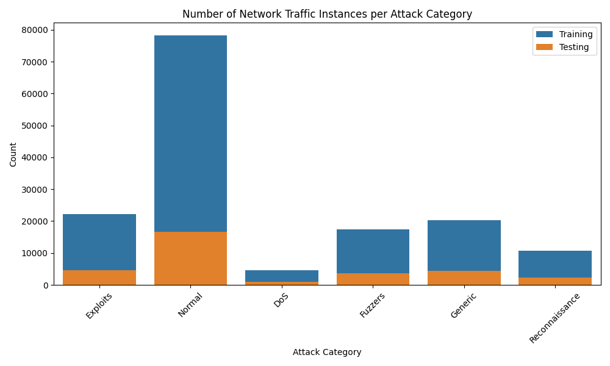
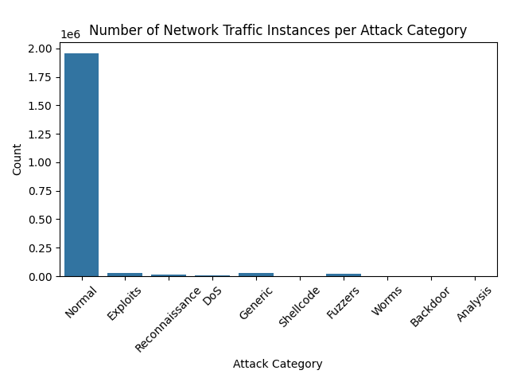
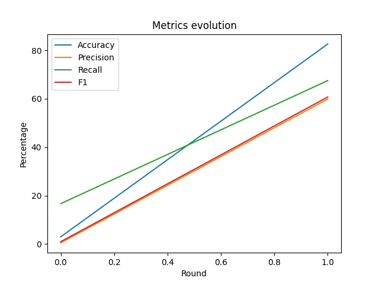
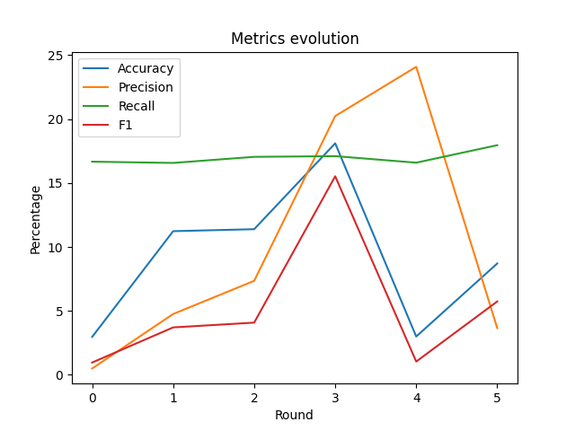
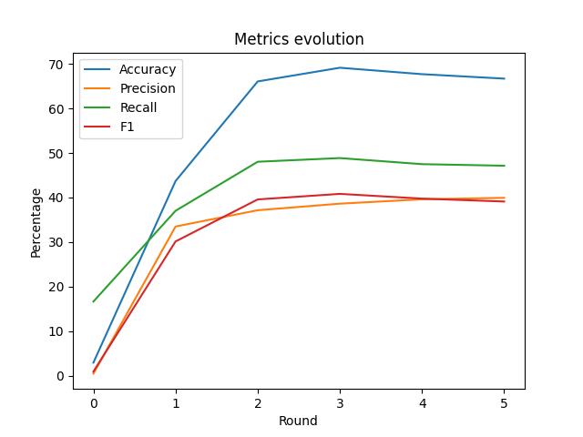
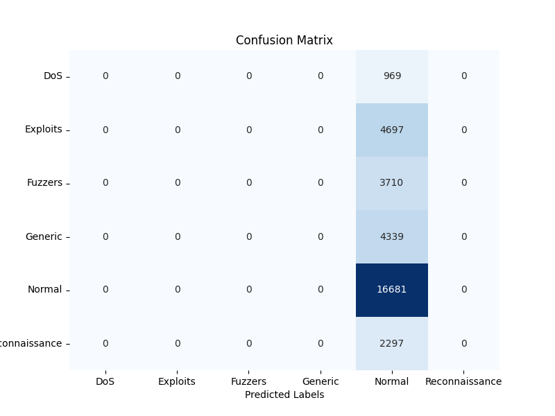

    ---
    title: Intrusion Detection System for IoT devices using Federated Learning
    author: Clément Safon, Sarah Ramdani
    date: 30-01-2024
    place: Télécom SudParis, Palaiseau, France
    ---

    \newpage

    # Abstract 

    > With IoT systems spreading across all the different domains and aspects of our lives for the past few years, attacks on these devices have likewise seen a rise. Intrusion Detection Systems come in handy to identify and prevent any intrusion or attack directed towards these systems. However, in a world where the concern for data protection is crucial, it is important not to share data. Hence the raise of Federated Learning, especially in Intrusion Detection Systems. 

    \newpage


    # 1. Introduction   

    As the Internet of Things (IoT) continues to proliferate across diverse domains, the security challenges associated with IoT devices become increasingly paramount. This paper, as part of a Master's year project, presents an approach to enhancing the security of Local Area Networks (LAN) with IoT environments through the implementation of an Intrusion Detection System (IDS) utilizing Federated Learning (FL). 

    This paper aims to present Federated Learning, and goes into details on how it works (the theory behind it), and is constructed around the multiple experiments which where conveyed over the course of this project. During this project, we aimed to implement a basic IDS using different libraries which we will explore in the following parts.
    The proposed system leverages the decentralized nature of FL to address privacy concerns inherent in traditional centralized IDS architectures. In this research project, we aimed to investigate further on Intrusion Detection Systems, and get a grasp of their functioning. With first a binary classification, then multi-class classification. 

    Our framework enables IoT devices to collaboratively train a global intrusion detection model while keeping sensitive data localized on individual devices. This decentralized approach not only enhances data privacy but also contributes to the scalability and efficiency of the intrusion detection process. We evaluate the effectiveness of our system through extensive simulations and experiments, demonstrating its ability to detect a wide range of intrusions while preserving the confidentiality of sensitive information.

    The results showcase the potential of Federated Learning as a privacy-preserving solution for building strong Intrusion Detection Systems in IoT environments. The proposed framework not only addresses the current security challenges in IoT but also provides a foundation for developing adaptive and intelligent security mechanisms for the evolving landscape of connected devices. Notwithstanding, as robust as it may appear, our implementation was vulnerable and not fully resilient to specific FL-oriented attacks such as Data Poisoning. Some counter-measures were identified, such as the KrumFusion for instance, to tackle this issue. 

    *We would like to point out that as Network Security students, Machine Learning, thus Federated Learning, is not our area of expertise. The purpose of this research project was to understand how Federated Learning was used in Network Intrusion Detection Systems (NIDS) and to understand how it could be implemented, and the main issues concerning this technique.*

    **As this paper is still a draft, the following statement might evolve over the time:**
    This paper is sectionned as follows: first, we expose Federated Larning and explain how it works.
    Then, we will explore our two approaches for this experiment, both with with binary and multi-class classification. 

    \newpage

    # 2. Federated Learning: An overview 

    Federated Learning is a machine learning approach that enables model training (and testing) across decentralized devices holding local data samples without exchanging them. The main goal is to build a model by collaborativly learning from local data while keeping the data localized and private. There are many different kinds of implementations as well, and we will only talk about cross-device federated learning, since we want a scenario where some individual clients (which represent the IoT subnetworks) can contribute to the creation of a global model, which is more accurate than the individual ones.

    The main steps of the federated learning are the following :  

    - **Initialisation** : This step can be offline or online. In this part we create the unique shape of the model and some local training parameters like the number of epochs, the batch size or the validation split for each client  
    - **Local Training** : The local devices use their local data to futher train the global model. Then they send to the aggregator the weights of their new model.  
    - **Aggregation** : The servers then collect all the different results and combine them to get a global model. *(We will see after that what kind of fusion we can do to get a global model)*  
    - **Iteration** : The weights of the global model are sent back to each client and we repeat the steps 2 and 3 until we finished.  

    > In some cases, we can combine Federated Learning and Transfert Learning to have better results. To do so, after reiceiving the last global model from the server, one device can decide to perform an other local training to enhace the performance of its model in its particular situation.

    So now, what are the different way to merge the client's model in the aggregation step ?

    >**(How are the data aggregated? )**

    So after the clients train their models, updated model parameters are sent to the server-based aggegator. To aggregate the new parameters to the global model, the most simple method used is called _FederatedAverage_. This algorithm aggregates the parameters by doing a weighted mean between all the client's model. The weight of each client can be calculated based on their dataset's size, number of epochs passed during the training or other parameters. 

    By only exchanging weight parameters instead of raw data, this process is inherently privacy-preserving. However, this scheme is not fully safeguarded against all types of malicious attacks: different attacks, such as _Membership inference_ for example.

    In this study we will almost only use the _FederatedAverage_ method, but in the last part, we will process some simulation using another method called _KrumFusion_. In this method, client are evaluated just before they contribute to the global model. If one client seems malicious, its contribution to the global model will be different from the other normal clients. So by evaluating the client's contribution, we can exclude the client responsible of an anormal contribution to the global model. 

    >**Need more sources**

    Our Intrusion Detection System is a behavior-based IDS, opposed to a Rule Based Intrusion detection system[[7]](#7). In other words, the IDS classifies the incidents based on an event rather than based on rules. This means the different incidents are classified as belonging to certain classes (in a binary classification, either legitimate (or normal) traffic, and illegitimate (or malicious) traffic). This approach is extremely effective as it is a good compromise between both generality and precision, however, it does not give specific insights on the attack in particular, and in the case of our first binary classification experiment, did not specify to which attack category it belonged to. In addition, this is an *anomaly based detection*, which is when the normal (or legitimate) traffic is learned by the algorithm

    \newpage

    # 3. Dataset presentation

    The dataset on which this project is based is the UNSW-NB15 dataset. Before this dataset, two others were largely looked upon: KDDCUP99 and NSLKDD. However, these two datasets were outdated, and not representative of the actual traffic representation. [[1]](#1) The UNSW-NB15 dataset is a hybrid model: it is constructed based on real modern and normal behavior, with synthetical attack activities. 

    The dataset creation involves using the IXIA traffic generator configured with three servers, where one server simulates illegitimate traffic. The generated data is in pcap format, transformed into CSV files using tools like Argus and Bro-IDS. Features extracted include packet-based and flow-based characteristics, categorized into "Basic," "Content," and "Time."

    

    Eleven types of attacks were categorized, as follows: \
    - Fuzzers
    - Analysis 
    - DoS 
    - Exploits
    - Generic
    - Reconnaissance 
    - Shellcode 
    - Backdoors 
    - Worms  

    2,540,044 flows of traffic were opened for this dataset. 
    It is important to notice that in this dataset, the distribution is not equal for every attack [[2]](#2), and quite different in some ways. This can largely affect the classifications (see results).
    The features were classified into three groups : Basic, Content, and Time. '0' refers to, in the dataset, as a regular behavior, while '1' refers to a malicious behaviour. 

    In this dataset, there were two main problems: 
    - class imbalance 
    - class overlap.

    In multiple experiments which will be presented further in this document, some classes 

    ## 3.1 Preprocessing 

    The initial stage involves preprocessing the data to tailor the raw dataset to our requirements. Initially, we merge the four files from the original UNSW-NB15 dataset. Subsequently, we eliminate duplicate entries and identify the desired features based on the criteria outlined in this article [[2]](#2). This ensures consistency in results and provides a solid foundation for our analysis. The selected features are :


    | Feature No. | Input Feature Name | Description                                     |
    |:-----------:|:-------------------:|:-----------------------------------------------:|
    |      1      |         dur         |        Record total duration                    |
    |      2      |        proto        |        Transaction protocol                     |
    |      3      |       service       |   Contains the network services                  |
    |      4      |        state        | Contains the state and its dependent protocol   |
    |      5      |        spkts        | Source to destination packet count               |
    |      6      |        dpkts        | Destination to source packet count               |
    |      7      |       sbytes        | Source to destination transaction bytes         |
    |      8      |       dbytes        | Destination to source transaction bytes         |
    |      9      |        rate         | Ethernet data rates transmitted and received    |
    |     10      |        sttl         | Source to destination time to live value         |
    |     11      |        dttl         | Destination to source time to live value         |
    |     12      |       sload         | Source bits per second                           |
    |     13      |       dload         | Destination bits per second                      |
    |     14      |       sloss         | Source packets retransmitted or dropped         |
    |     15      |       dloss         | Destination packets retransmitted or dropped    |
    |     16      |       sinpkt        | Source interpacket arrival time (mSec)          |
    |     17      |       dinpkt        | Destination interpacket arrival time (mSec)     |
    |     18      |        sjit         | Source jitter (mSec)                             |
    |     19      |        djit         | Destination jitter (mSec)                        |
    |     20      |        swin         | Source TCP window advertisement value            |
    |     21      |       stcpb         | Destination TCP window advertisement value       |
    |     22      |       dtcpb         | Destination TCP base sequence number             |
    |     23      |        dwin         | Destination TCP window advertisement value       |
    |     24      |       tcprtt        | TCP connection setup round-trip time             |
    |     25      |     attack_cat      | The name of each attack category. In this data set, nine categories e.g. Fuzzers, Analysis, Backdoors, DoS Exploits, Generic, Reconnaissance, Shellcode, and Worms |
    |     26      |       label         | 0 for normal and 1 for attack records           |

    Some features were redundant in the testing set, such as ... and ... which are actually other. 

    After this step, we reduce the normal traffic by randomly taking a part of the traffic with a label equal to 0. This can allow us to reduce the normal traffic and to simplify the classification. Finally, we also simplify the problem by dropping the unpopulated attack categories.

    After having randomly split the entier dataset in a training set (80%) and a testing set (20%), the data distribution is : 

    

    Here we have taken 5% of the normal trafic entries.

    We can also mention that some other preprocessing will be done juste before the simulation process, during the creation of the client's datasets. In those steps, we take the data, create the X and Y vectors based on the *attack_cat* and *label* features. Then we apply a one hot encoding and a quantile transformation. The one hot encoding allow us to convert proprely the nominal features without introduce non wanted relation between the nominal classes. The quantile transformation is choose accordingly th the vizualisation article. This method ensures increased separation between centroids of each class, making them more distinguishable and facilitating easier detection of individual classes.

    >**Copier la figure des centroids ?**

    ## 3.2 Visualization 

    


    In order to understand the results better and to get a clear view on what information they do provide, different visualization approaches were in use. 

    175,341 records were selected for the training set, 82,332 records for the testing set. 
    All of the features may not be relevant. The nominal features are converted to numeric features. 
    After the distance between centroids has been calculated, the results are plotted. 
    On the plot, a colored scaled represents as follows: the darker shades mean that the centroids were separated by a long distance, the lighter, by a shorter distance (classes are closer).

    insert the images of the visualisation artiicle (or just cite the article)
    ->
    Principal Component Analysis (PCA) is 
    Overlap problem: many attacks have a similar behavior comparing to 

    ## 3.3 Evaluations 

    In order to evaluate the different models, a large panel of metrics came in handy. Among them, the following ones: 

    - Precision: this metric is used to evaluate the performance of the FL model. It assesses the accuracy of positive predictions made by a classification model. This metric is determined by dividing the number of correct positive predictions (true positives) by the total sum of correct positive predictions and incorrect positive predictions (false positives). In essence, precision evaluates the model's capability to make positive predictions with a high level of correctness.  

    $$
    Precision = \frac{True\ Positives}{True\ Positives + False\ Positives}
    $$

    - Recall: also referred to as the true positive rate, quantifies the ability of a classification model to correctly identify instances belonging to the positive class. This metric is computed by dividing the number of true positive predictions by the total sum of true positive predictions and false negative predictions. In essence, recall assesses the model's effectiveness in capturing and correctly labeling all actual positive cases among the predicted outcomes.  

    $$
    Recall = \frac{True\ Positives}{True\ Positives + False\ Negatives}
    $$

    - F1 Score: the F1 Score will then compute the harmonic mean between the precision and recall.

    $$
    F1\ Score = \frac{2 \times Precision \times Recall}{Precision + Recall}
    $$

    - Accuracy: 
    $$
    Accuracy = \frac{True\ Positives + True\ Negatives}{Total\ Examples}
    $$


    Centralized EValuations.
    Federated Evaluation


    old part :
    Different methods exist to evaluate models: FedFomo [[4]](#4) and L2C (Learning to Collaborate) are one of them. These two techniques are personalized FL algorithms which locally evaluate the models from other clients to locally customize them.  
    **Important remark: these evaluation methods were only studied and researched at the beginning. They were not used during the course of our project. Notwithstanding, we found them interesting, and they could be the subject of further research by the reader.**

    For client selection in federated learning : 
    Interesting topic to learn more about how Trusted Execution Environment (TEE) may make FL more robust against integrity attacks: 
    Y. Chen et al., “A Training-Integrity Privacy-Preserving Federated
    Learning Scheme with Trusted Execution Environment,”
    Information Sciences, vol. 522, 2020, pp. 69–79.

    The device's resource, time consumption, as well as communcation cost should be looked upon in order to determine the selection of clients. 

    \newpage

    # 4. Implemented IDS

    [IBM-FL](https://github.com/IBM/federated-learning-lib/tree/main) was the first notebook used to understand more ML and FL concepts.
    Flwer is the second module which was used in this experiment. 

    The computer which was used to train all the data is 

    Number of epochs + rounds for each training.

    ## 4.1. The Simulation Environment

    In this part we are just going to describe the simulation process that we used in our set up. In order to get the previous results we went into many simulations, adjusting a lot of parameters. And to do so, we have decided to create a simulation template, that can allow everyone to reroduce our experimentations. Instead of creating a Jupyter Note Book, we've created à [GitHub project](https://github.com/ClementSafon/IDS_FL_Simulation) that have all the necessary ressources to execute simulation without having to write anything. To reproduce, modify or go deeper into our researches, you can find all you need in this repository. There is documentation about, how to install, configure and run a simulation. Feel free to fork this project in case you want to upgrade it.


    ## 4.2. First experiment: binary classification

    In the first experiment, we went for the most simple IDS behavior, the one that can classify a network traffic either in Normal or Malicious. That allowed us to understand the federated mechnaismes and to manipulate some basic and still efficient models. In this party, we worked a lot base on the work of the works of [Yann Busnel and Léo Lavaur](https://github.com/phdcybersec/nof_2023/tree/main). The main objective here was to understand how the classification models works, how we can set up a federated learning environment to test the performances of our machine learning process and finally, show the benefit of the federated learning compared to traditionnal machine learning.

    This first experiment consisted in two main things: 

    First, after having tested many configurations, we had some good results in terms of F1-score and Accuracy for example. **Put example here**. So after this first step we were able to test some aspect of the federated learning. The capacity that interrested us the most was the fact that with federated learning, each client can contribute to upgrade the model with his own data that may not be shared with other clients. For example, a certain maliscious behaviour in one precis subnetwork can be good for other client too. So we were now, trying to test the ability of our training process to delivre complementary informations between clients.

    To prove this, we have to split the dataset into the N clients, but this time, not randomly since some client must not have a particular type of data. The two method taken into account were, splitting data by IP sources or destinations to affect one client to one real subnetwork for example, or splitting data according to there attack categorie to allow us to put only specific attack categories for one client, and see if this client is able to performe well on the detection of unknown attack categories thanks to the federated learning. Finally we went for the second method, since we were able to split data more precisly and independantly from the network configuration of the dataset creation team.

    So now, we are able to split all the data between N client and destroy all the data categorised as *Backdoors* for just one client. Then we wanted to see if that same client can, after the learning process, detecte well the backdoors thanks to the federated learning. However, it is here that the bigest problem of our simulation was. Indeed, we were classifying the network traffic as either Normal or Maliscious. So when testing the special client performance, we were not able to detecte if this client was able to detecte especially *Backdoors* or not and the impact since *Backdoors* results are just drown into all the Maliscious results. That is why, more precision was requested to be able to detecte precis results, and we went for a multiclassification in the second part.


    


    ## 4.3. Second experiment: multi-class classification

    In this section, we explore our second experiment, this time with multi-class classification Federated Learning. 


    ## 4.4. Data repartition

    Will be presented in this section the different data repartitions of the three experiments we conveyed.
    The first one, there is only one client which is trained on the whole dataset.
    

    The second one, still with only one client  the first which has no network traffic from the "Generic class" in the training set.
    

    The third one, which was the last experiment we conducted, where each client had an even repartition of the dataset (1/3 of each class in which the network traffic was selected randomly), with the first client (client 0) who does have any traffic from the "Generic" attack class.

    

    The third experiment was done in order to test if client 0 would benefit from the other clients by 
    **Pourquoi ne pas avoir fait CL, FL avec tout, FL avec un client sans une classe?**


    In this experiment, the feature "rate" was not taken in the features we wanted to keep. 
    Even though in most litterature, only 24 features out of the 41 were kept, amongst which the feature "rate" was taken into account, in the training and testing set provided by the creators of the UNSW-NB15 dataset.

    What we didn't take into account is that the FE is different for every client. They are going to evaluate the same model. 

    ## 4.5 Results

    The evaluation is then done after the aggregation part. 

    After all the experiments, we can now conclude that the clients get better and they learn from the others. 

    

    

    

    # 5. Attacks
    ## 5.1 Attack models

    After the end of the implementation, the following part consisted in testing if the models were resilient to different attacks, and test different data poisoning scenarios
    In the first two attack attack scenario, the attacker has no knowledge of the actual infrastructure, nor of how many clients there are. In the third one, the client tries to infer on the number of clients which are part of the training. 

    ### 5.1.1 Fuzzing attack

    For this attack scenario, the goal was to test the system's robustness and security by simulating a potential threat. Fuzzing can help discover and address issues related to data handling, model updates, and communication protocols within the federated learning framework, which could help improve the overall system.

    The code we used to perform the fuzzing attack is the following:

    ```python
    for i in range(len(parameters)):
        random_values = np.random.uniform(low=-5, high=5, size=parameters[i].shape)
        parameters[i] = random_values
    return parameters, len(self.x_train), {}
    ```

    It replaces the original values in each element of the parameters list with randomly generated values within the range of -5 to 5, where normally the weights are supposed to take values from -1 to 1. The function then returns the modified parameters, the length of the training dataset (self.x_train), and an empty dictionary.

    { width = 70% }

    

    ### 5.1.2 Simple poisoning attack

    { width = 70% }

    


    ### 5.1.3 Targeted poisoning attack

    This third attack consisted in a targeted attack, in which the attacker has the knowledge how many clients there are in the model update. This attack scenario may seem less realistic, as only the agregator server is supposed to hold this information. 
    In the attack we conveyed, there are three steps:

    1. The attacker first trains the model in order to estimates the weights of the other clients.  
    2. Then, the attacker will 

    

    

    This is, by far, the most effective attack scenario. According to the Confusion Matrix (Figure[?]) All the malicious traffic was classified and predicted as normal traffic. 

    # 6. Counter-measures 

    (To be discussed.)


    # 7. Issues with Federated Learning and with Machine Learning in general


    In this section, many issues and challenges which occur in Machine Learning as well as in Federated learning will be covered.

    In any type of Machine Learning in general, the cleanliness of the data as well as the accurate labellisation is crucial. In our case, this had tremendous impact on the quality of the Intrusion Detection System, and can interfere with any potential commercial or legitimate usage.

    IDSs, which many now rely on machine learning, play a critical role in cybersecurity, but misclassifications can have severe consequences. [3](#)These systems are central pillars to identify and respond to potential security threats, making them integral components of modern defense strategies. However, the impact of misclassifications, where benign activities are incorrectly flagged as malicious (false negative) or vice versa (false positive), can compromise the overall security posture. It reveals thus the importance of continual refinement and fine-tuning of ML/FL models within IDS to minimize false positives and negatives, and to ensure accurate threat detection without unnecessary disruptions to normal operations.

    > What is the rate of false positives which make IDS unusable for real life conditions? 

    The diversity in the network traffic also appears to be an issue. Let's imagine that we train a FL model with a certain type of network traffic. 
    Diversity in the network traffic.

    In ML, it is needed to have a suffiscient amount of data for each and every class in order to learn properly from the training dataset, and in order to detect them as well. How much?

    \newpage


    # 8. Conclusion

    In this research project, we explored the application of FL in the context of Intrusion Detection Systems (IDS) with Internet of Things (IoT) environments. The proliferation of IoT devices has increased the complexity of security challenges, making robust IDS crucial for safeguarding networks. Traditional centralized ML architectures pose privacy concerns, leading us to investigate the use of FL as a privacy-preserving solution.

    The paper provided an overview of Federated Learning, explaining its principles and detailing the steps involved in the training process across decentralized devices. We implemented a FL-based IDS framework that allows IoT devices to collaboratively train a global intrusion detection model while keeping sensitive data localized. This decentralized approach enhances data privacy, scalability, and efficiency in the intrusion detection process.

    Throughout our experiments, including both binary and multi-class classifications, using the UNSW-NB15 dataset, the results demonstrated the potential of FL as a privacy-preserving solution for building effective IDS in IoT environments. However, we acknowledged the vulnerability of our implementation to specific FL-oriented attacks such as Data Poisoning and identified counter-measures. We would still like to point out that our implementation is rather simple: it was a three client architecture, 

    The research highlighted the challenges and issues in the application of FL to IDS, such as the need for clean and accurately labeled data, diversity in network traffic, and the impact of false positives and negatives on the overall security posture. Additionally, we discussed the importance of continuous refinement and fine-tuning of ML/FL models within IDS to enhance accuracy.

    The paper concluded by addressing potential counter-measures to the identified issues and emphasized the ongoing need for research and development in the intersection of Federated Learning and Network Security. Overall, this student research project contributes to understanding how FL can be utilized in the field of network security, paving the way for adaptive and intelligent security mechanisms in the evolving landscape of connected devices.

    Our experiments, ranging from binary to multi-class classifications using the UNSW-NB15 dataset, underscored the effectiveness of FL as a privacy-preserving solution. The decentralized learning process proved capable of detecting a wide range of intrusions while maintaining confidentiality. The experiments also exposed certain vulnerabilities, such as susceptibility to FL-oriented attacks like Data Poisoning. Identifying counter-measures, such as the KrumFusion method, is a step towards fortifying our FL-based IDS against potential threats.

    In acknowledging the challenges encountered, including data cleanliness, accurate labeling, and the impact of false positives and negatives, we underscore the importance of continual refinement and fine-tuning of our models. The diversity in network traffic emerged as a significant consideration, prompting us to recognize the need for a sufficient amount of diverse data for effective training and detection.


    [commment] (#
    - Expériences, bilan, enseignements à tirer comment bien effecuter l'apprentissage
    - Présenter les résultats avec hopefully les résultats cohérents qui co
    - état de l'art/background/restituer les recherches
    - Attention
    - Dire les obstacles qu'on a rencontré
    - Fuzzing 
    - Fonction)

    \newpage


    # References
    <a id="1">[1]</a> 
    Moustafa, Nour & Slay, Jill. ([2015](https://www.researchgate.net/publication/287330529_UNSW-NB15_a_comprehensive_data_set_for_network_intrusion_detection_systems_UNSW-NB15_network_data_set)). 
    *UNSW-NB15: a comprehensive data set for network intrusion detection systems (UNSW-NB15 network data set).*
    10.1109/MilCIS.2015.7348942. 

    <a id="2">[2]</a>
    Zoghi, Zeinab & Serpen, Gursel. ([2021](https://arxiv.org/abs/2101.05067)).
    *UNSW-NB15 Computer Security Dataset: Analysis through 
    Visualization.*
    Electrical Engineering & Computer Science, University of Toledo, Ohio, USA.

    <a id="3">[3]</a> 
    ([2021](https://www.icir.org/robin/papers/oakland10-ml.pdf))
    *Outside the Closed World: On Using Machine Learning For Network Intrusion Detection*

    <a id="4">[4]</a> 
    Zhang, Michael, et al. ([2020](https://arxiv.org/abs/2012.08565)).
    "Personalized federated learning with first order model optimization." arXiv preprint arXiv:2012.08565 

    <a id="5">[5]</a> 
    Shuangton Li, et al. ([2022](https://openaccess.thecvf.com/content/CVPR2022/papers/Li_Learning_To_Collaborate_in_Decentralized_Learning_of_Personalized_Models_CVPR_2022_paper.pdf)). 
    "Learning to collaborate in decentralized learning."

    <a id="6">[6]</a> 
    Arp, Daniel et al. ([2020](https://www.usenix.org/system/files/sec22summer_arp.pdf)). 
    "Do's and Don'ts of Machine Learning in Computer Security"

    <a id="7">[7]</a> 
    Aguessy, François-Xavier. ([2023](https://moodle.imtbs-tsp.eu/mod/resource/view.php?id=22573)).
    "Intrusion detection and alert correlation (as part of a Télécom SudParis class)"

    <a id="8">[8]</a> 
    Fraboni, Yann, et al. ([2023](https://www.jmlr.org/papers/volume24/22-0689/22-0689.pdf))).
    "A General Theory for Federated Optimization with Asynchronous and Heterogeneous Clients Updates"